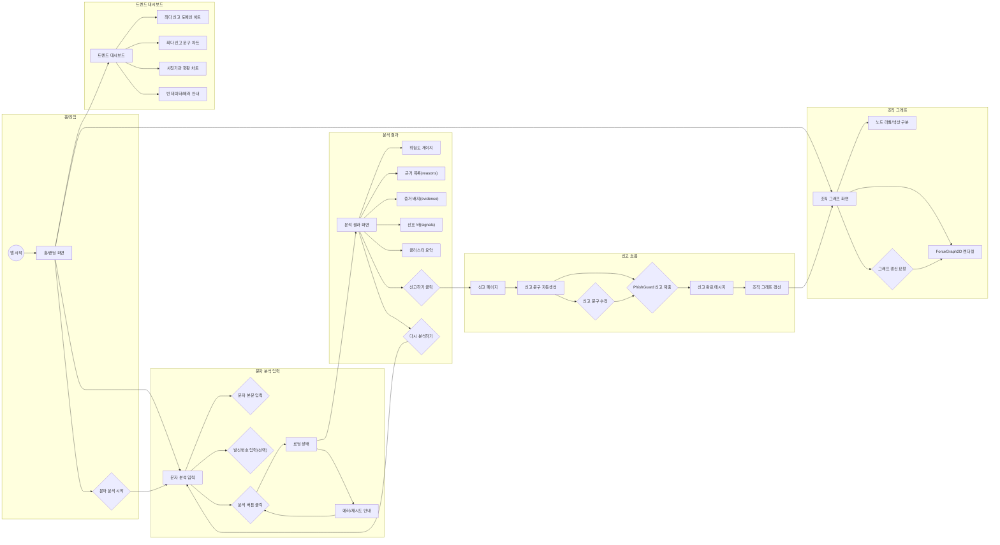

```mermaid
flowchart LR

  subgraph s1 ["홈/진입"]
    n1(("앱 시작"))
    n2["홈/랜딩 화면"]
    n3{"문자 분석 시작"}
  end

  subgraph s2 ["문자 분석 입력"]
    n4["문자 분석 입력"]
    n5{"문자 본문 입력"}
    n6{"발신번호 입력(선택)"}
    n7{"분석 버튼 클릭"}
    n8["로딩 상태"]
    n9["에러/재시도 안내"]
  end

  subgraph s3 ["분석 결과"]
    n10["분석 결과 화면"]
    n11["위험도 게이지"]
    n12["근거 목록(reasons)"]
    n13["증거 배지(evidence)"]
    n14["신호 바(signals)"]
    n15["클러스터 요약"]
    n16{"신고하기 클릭"}
    n17{"다시 분석하기"}
  end

  subgraph s4 ["신고 흐름"]
    n18["신고 페이지"]
    n19["신고 문구 자동생성"]
    n20{"신고 문구 수정"}
    n21{"PhishGuard 신고 제출"}
    n22["신고 완료 메시지"]
    n23["조직 그래프 갱신"]
  end

  subgraph s5 ["조직 그래프"]
    n24["조직 그래프 화면"]
    n25["ForceGraph2D 렌더링"]
    n26["노드 라벨/색상 구분"]
    n27{"그래프 갱신 요청"}
  end

  subgraph s6 ["트렌드 대시보드"]
    n28["트렌드 대시보드"]
    n29["최다 신고 도메인 차트"]
    n30["최다 신고 문구 차트"]
    n31["사칭기관 현황 차트"]
    n32["빈 데이터/에러 안내"]
  end

  n1 --> n2
  n2 --> n3
  n2 --> n4
  n2 --> n24
  n2 --> n28
  n3 --> n4
  n4 --> n5
  n4 --> n6
  n4 --> n7
  n7 --> n8
  n8 --> n10
  n8 --> n9
  n9 --> n7
  n10 --> n11
  n10 --> n12
  n10 --> n13
  n10 --> n14
  n10 --> n15
  n10 --> n16
  n10 --> n17
  n17 --> n4
  n16 --> n18
  n18 --> n19
  n19 --> n20
  n19 --> n21
  n20 --> n21
  n21 --> n22
  n22 --> n23
  n23 --> n24
  n24 --> n25
  n24 --> n26
  n24 --> n27
  n27 --> n25
  n28 --> n29
  n28 --> n30
  n28 --> n31
  n28 --> n32
```
